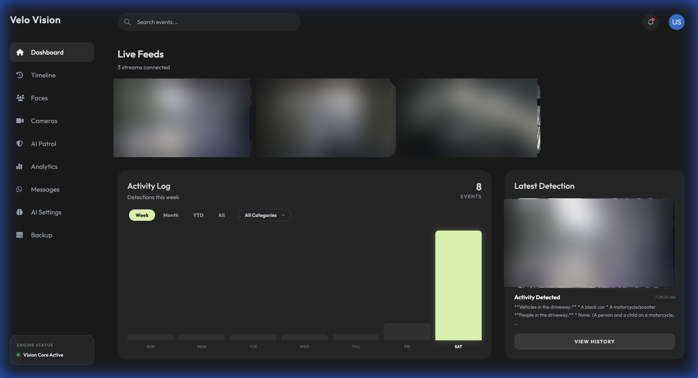
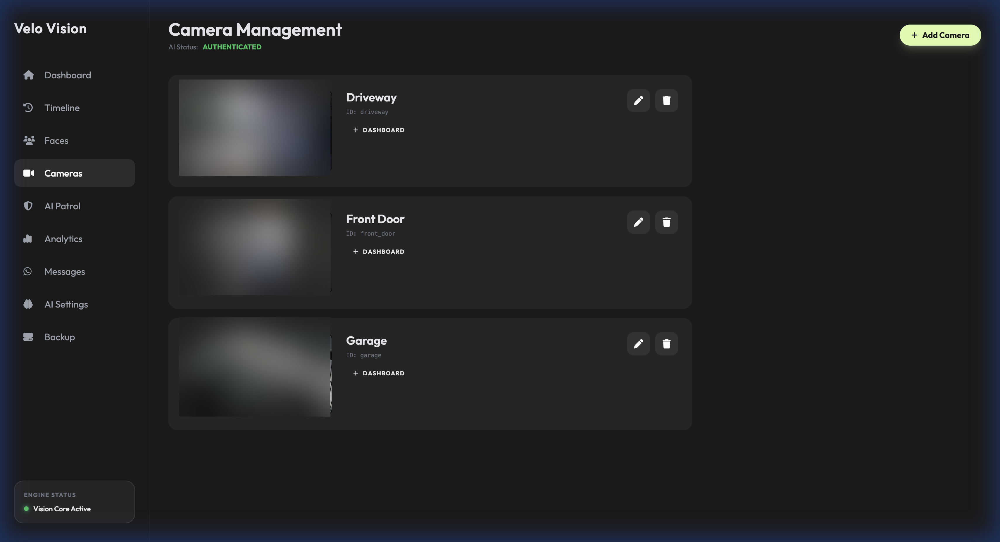
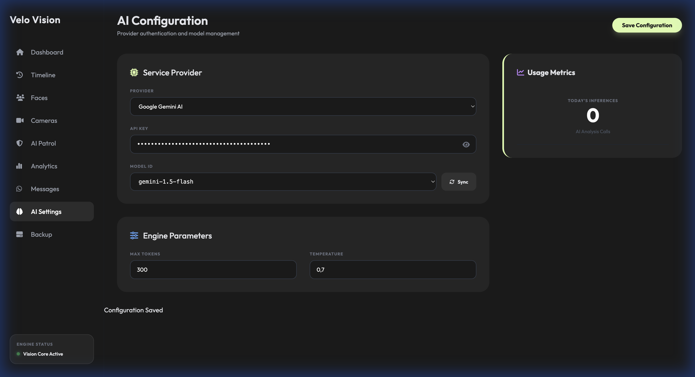
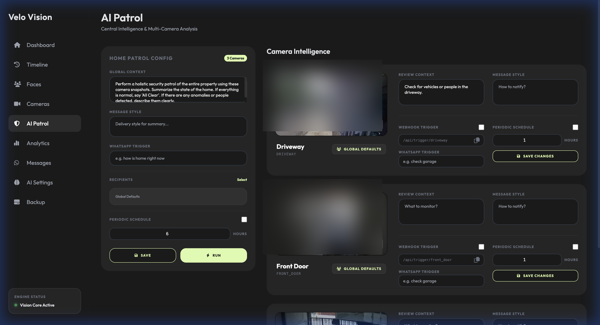
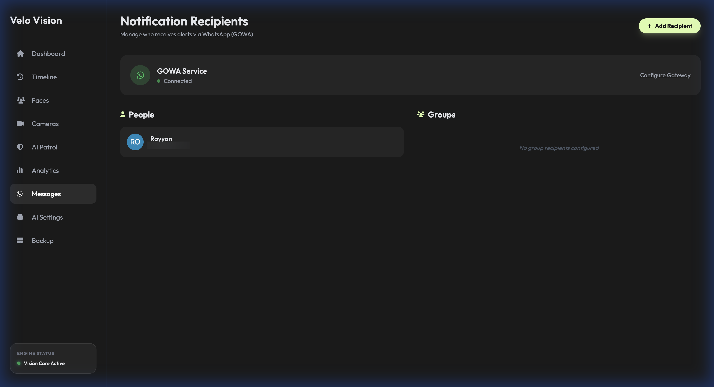
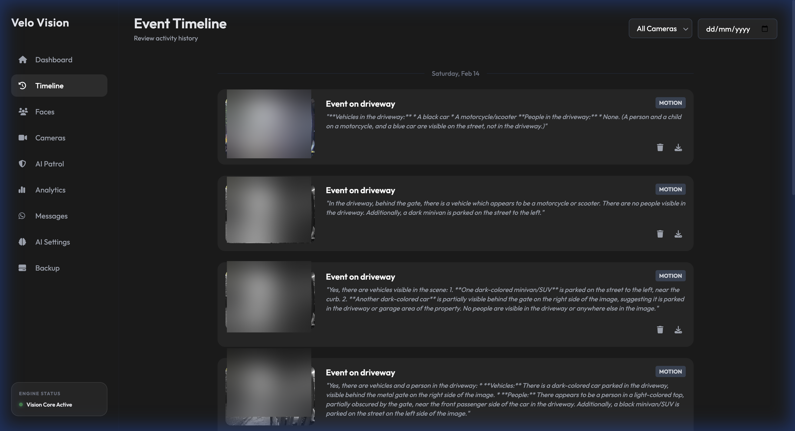
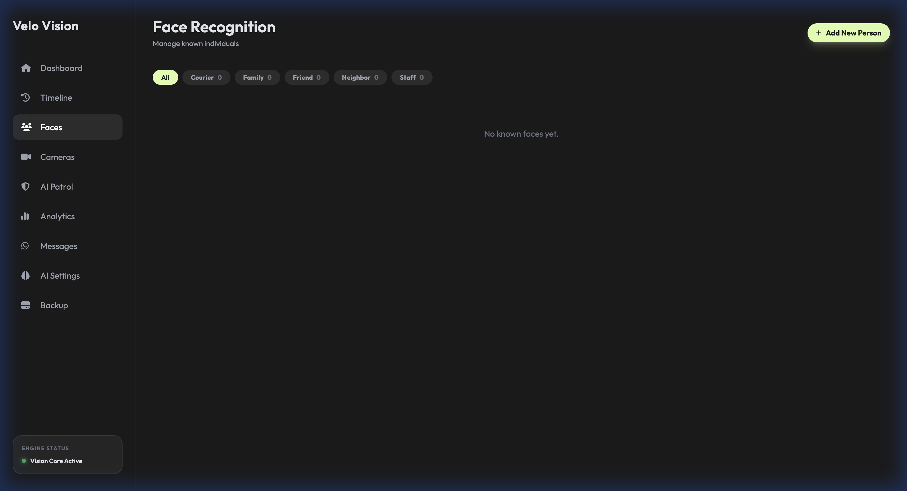
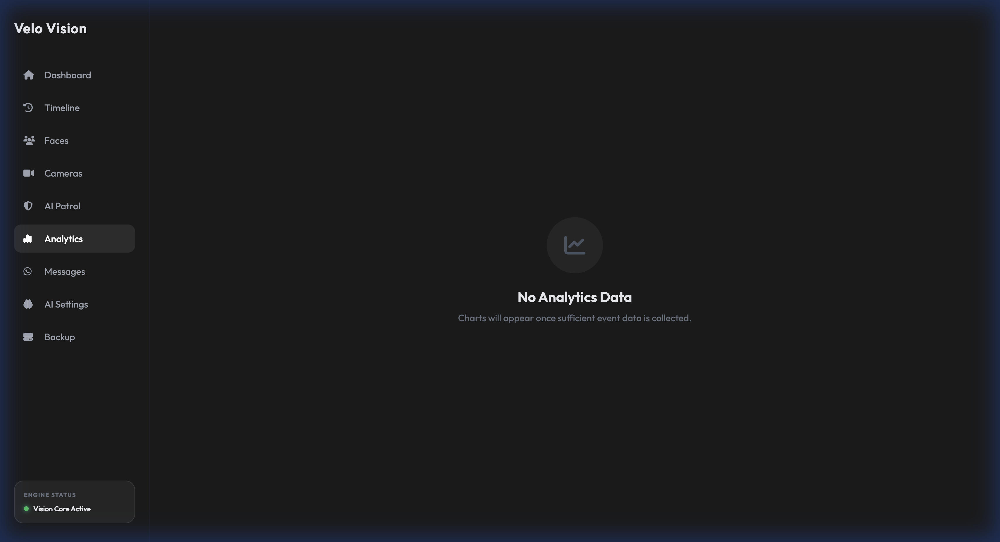
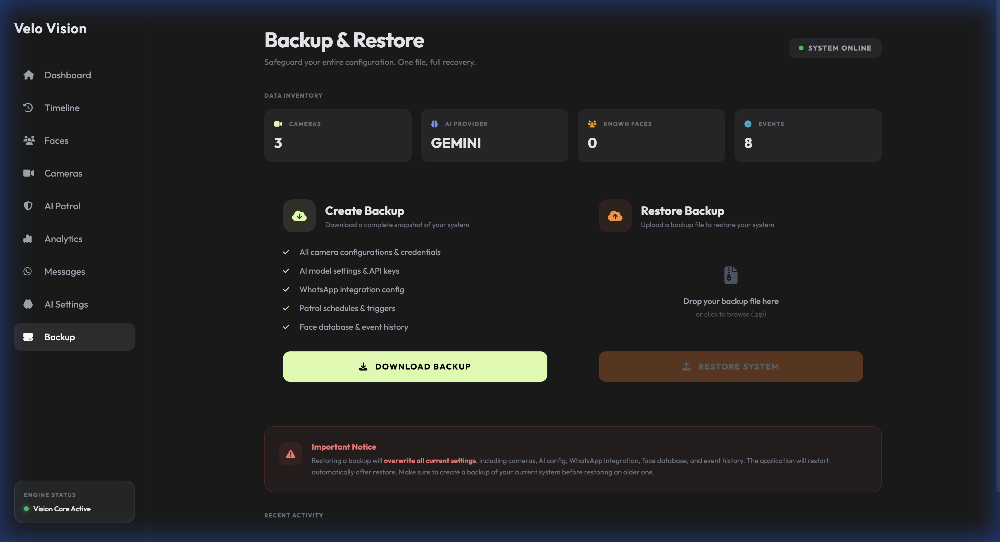

<div align="center">

# Velo Vision

**AI-Powered Home Surveillance System**

A self-hosted, Docker-based surveillance platform with multi-camera management, AI-powered scene analysis, WhatsApp notifications, face recognition, and a premium dark-themed dashboard.



</div>

---

## Core Features

### Camera Management
- **Multi-camera support** — RTSP, ONVIF, and HTTP stream protocols
- **Stream URL Builder** — Auto-discovers stream URLs via ONVIF with manual override
- **Connection testing** — Validate camera feeds before saving
- **Live dashboard feeds** — Real-time snapshots from all cameras at a glance



### AI-Powered Intelligence
- **Scene analysis** — Powered by Google Gemini or OpenAI vision models
- **Motion detection** — Frame-differencing with configurable sensitivity
- **Object & activity descriptions** — AI narrates what it sees (vehicles, people, activity)
- **Configurable engine parameters** — Model selection, token limits, temperature tuning



### AI Patrol
- **Holistic property patrol** — AI reviews all cameras simultaneously and summarizes the state of the home
- **Per-camera intelligence** — Custom review context and notification rules per camera
- **Periodic scheduling** — Automated patrols on configurable intervals (e.g., every 6 hours)
- **WhatsApp triggers** — Respond to natural language queries like "how is home right now"
- **Webhook triggers** — Trigger patrols via REST API endpoints



### WhatsApp Notifications (GOWA)
- **Real-time alerts** — Receive detection alerts on WhatsApp via the GOWA service
- **Recipient management** — Add individual contacts or group recipients
- **Configurable gateway** — Connect to your own GOWA WhatsApp gateway instance



### Event Timeline
- **Activity history** — Browse all detection events with timestamps and AI descriptions
- **Camera filtering** — Filter events by specific camera or view all
- **Date picker** — Navigate to any date in the event history
- **Event actions** — Download snapshots or delete events



### Face Recognition
- **Known person registry** — Add and categorize known individuals (Family, Friend, Neighbor, Courier, Staff)
- **Face encoding** — Upload photos to build recognition profiles
- **Category filtering** — Filter faces by category



### Analytics Dashboard
- **Detection charts** — Visualize activity trends over time (Week, Month, YTD, All)
- **Category breakdown** — Filter by detection categories
- **Event statistics** — Track total events and patterns



### Backup & Restore
- **One-click backup** — Download a complete snapshot of your entire system configuration
- **Drag & drop restore** — Upload a backup file to restore cameras, AI config, WhatsApp settings, face database, and event history
- **Data inventory** — View system stats before backup (cameras, AI provider, known faces, events)



---

## Tech Stack

| Component | Technology |
|-----------|-----------|
| **Backend** | Python 3.11, FastAPI, Uvicorn |
| **AI Engine** | Google Gemini AI / OpenAI |
| **Computer Vision** | OpenCV, scikit-image, dlib |
| **Face Recognition** | face-recognition (dlib) |
| **Database** | SQLAlchemy (SQLite) |
| **Frontend** | Jinja2 Templates, Tailwind CSS |
| **Messaging** | WhatsApp via GOWA Gateway |
| **Camera Protocols** | RTSP, ONVIF, HTTP |
| **Scheduling** | APScheduler |
| **Deployment** | Docker, Docker Compose |

---

## Setup & Installation

### Prerequisites

- Docker & Docker Compose installed
- A Google Gemini API key (or OpenAI API key)
- IP cameras with RTSP/ONVIF/HTTP support (optional for initial setup)
- GOWA WhatsApp gateway instance (optional, for notifications)

### Quick Start with Docker Compose

1. **Clone the repository:**
   ```bash
   git clone https://github.com/mniroy/velovision.git
   cd velovision
   ```

2. **Create the data directory:**
   ```bash
   mkdir -p data
   ```

3. **Start the application:**
   ```bash
   docker compose up -d --build
   ```

4. **Access the dashboard:**
   Open [http://localhost:8000](http://localhost:8000) in your browser.

5. **Initial configuration:**
   - Navigate to **AI Settings** → Enter your Gemini or OpenAI API key
   - Navigate to **Cameras** → Add your camera streams
   - Navigate to **Messages** → Configure WhatsApp gateway (optional)
   - Navigate to **AI Patrol** → Set up patrol schedules

---

### Portainer Stack Configuration

For deployment via **Portainer**, use the following stack configuration:

```yaml
version: '3.8'

services:
  velovision:
    build: .
    container_name: velovision
    ports:
      - "8000:8000"
    environment:
      - DATABASE_URL=http://localhost:8000
      - TZ=Asia/Jakarta
    extra_hosts:
      - "host.docker.internal:host-gateway"
    volumes:
      - ./data:/data
      - ./src:/app/src
    restart: unless-stopped
```

#### Environment Variables

| Variable | Description | Default |
|----------|-------------|---------|
| `TZ` | Container timezone | `Asia/Jakarta` |
| `DATABASE_URL` | Internal database URL | `http://localhost:8000` |

#### Volumes

| Mount | Purpose |
|-------|---------|
| `./data:/data` | Persistent storage for config, database, face data, event snapshots |
| `./src:/app/src` | Application source (enables hot-reload in development) |

#### Network

The `extra_hosts` configuration maps `host.docker.internal` to the host gateway, allowing the container to reach services running on the host machine (e.g., GOWA gateway).

---

## Project Structure

```
velovision/
├── src/
│   ├── main.py                # FastAPI application entry point
│   ├── config.py              # Configuration management
│   ├── camera_manager.py      # Camera lifecycle & streaming
│   ├── motion_detector.py     # Frame-diff motion detection
│   ├── ai_analyzer.py         # AI vision analysis (Gemini/OpenAI)
│   ├── face_manager.py        # Face recognition engine
│   ├── patrol_triggers.py     # Automated patrol scheduling
│   ├── routers/
│   │   ├── api.py             # REST API endpoints
│   │   └── ui.py              # HTML page routes
│   ├── templates/             # Jinja2 HTML templates
│   └── static/                # CSS, JS, and assets
├── data/                      # Persistent data (gitignored)
│   ├── config.yaml            # Application configuration
│   ├── velovision.db          # SQLite database
│   ├── faces/                 # Face encoding data
│   └── events/                # Event snapshots
├── docs/screenshots/          # README screenshots
├── Dockerfile
├── docker-compose.yml
├── requirements.txt
└── README.md
```

---

## Security Notes

- The `data/` directory contains sensitive information (API keys, camera credentials, face data) and is **excluded from Git** via `.gitignore`.
- API keys are stored in `data/config.yaml` and only accessible within the container.
- Camera stream URLs may contain authentication credentials — these are never exposed in the UI.
- The application is designed for **local network deployment**. If exposing externally, use a reverse proxy with HTTPS and authentication.

---

## License

This project is private and not licensed for public distribution.
